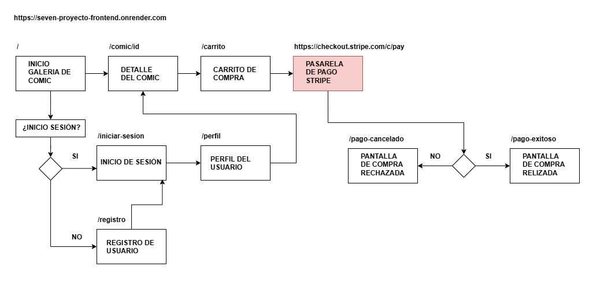

# 7 Proyecto Fullstack: Tienda de Cómics de Batman

Este proyecto es una aplicación web fullstack. Permite visualizar cómics, agregar productos al carrito y realizar pagos a través de Stripe.

## 🧩 Tecnologías utilizadas

- **Frontend:** React, React Router, Context API
- **Backend:** Node.js, Express, MongoDB, Mongoose
- **Despliegue:** Render (frontend y backend)
- **Pasarela de pago:** Stripe

## Estructura de la aplicación

La app cuenta con las siguientes vistas principales:

- `/` → Galería de cómics
- `/comic/:id` → Detalle del cómic
- `/carrito` → Carrito de compra (requiere sesión)
- `/pago-exitoso` y `/pago-cancelado` → Resultado del pago
- `/registro` y `/iniciar-sesion` → Autenticación de usuario
- `/perfil` → Actualización de la información del usuario

## Diagrama de flujo

Este diagrama representa el flujo de navegación y decisiones de la aplicación, incluyendo el proceso de compra y validación de sesión.

❤️ Este proyecto fue desarrollado por **Marco Rubio Bustos**.